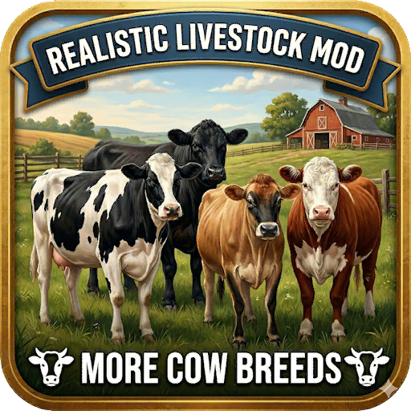

> [!NOTE]
> Ritter version of [FS25 Realistic Livestock]([https://github.com/Arrow-kb/FS25_RealisticLivestock](https://github.com/rittermod/FS25_RealisticLivestockRM)) is need for this to work.
>
> This is a WIP i am still working on the textures.

## FS25_CowBreedsRLRM
With the help of Ritter in creating the base structure of the mod, we are able to introduce 12 new cow breeds to the FS25_RealisticLivestockRM mod. This mod only adds new breeds with corresponding textures for each one. It does not replace the 3D models of the cows in the game. Therefore, the 3D assets may appear larger than the actual breed of cow.

## Features
### FOUR NEW DAIRY BREEDS
- Red Holstein
- Ayrshire
- Jersey
- Guernsey

### EIGHT NEW BEEF BREEDS
- Red Angus
-Hereford
-Charolais
-Shorthorn
-Irish Moiled
-British Blue
-Belted Galloway
-Simmental

## Installation
Place `FS25_CowBreedsRLRM.zip` in your mods folder.

## License
This mod is released under GPL-3 license. See the [LICENSE](LICENSE) file for details.

## Credit 
rittermod - https://github.com/rittermod full layout of mod.
