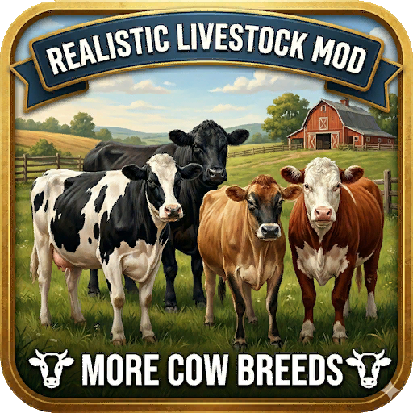

# FS25_CowBreedsRLRM

> [!NOTE]
> The [Ritter version of FS25 Realistic Livestock](https://github.com/rittermod/FS25_RealisticLivestockRM) is required for this mod to work.

A companion pack for **FS25 Realistic Livestock (RM)** that adds **13 new cow breeds** with their own textures, plus custom bull and calf models, per‑breed horns, and visual accessories for the base breeds. Breed economics (weight, feed, and outputs) are calibrated against RLRM's base breeds so each breed behaves the way you'd expect.

> [!WARNING]
> **Back up your save before installing.** Existing animals are migrated automatically on load, but migration **cannot guarantee every possible save state** — if an animal's breed can't be resolved, RLRM may drop it. Always test on a **copy** of your save first.
>
> **Map compatibility.** This pack replaces the game's cow husbandry configuration, so it will **not** work alongside maps that add their **own** extra cow breeds. It is **not compatible with Le Mechet** (its Charolaise / Simmental / Montbeliarde / Vosgienne breeds will not load), and the same likely applies to other breed‑adding maps. It **is** compatible with **Witcombe Park**.

## Requires
- **[FS25_RealisticLivestockRM](https://github.com/rittermod/FS25_RealisticLivestockRM)** — required. Tested against v1.2.4.0+.

## The breeds

**Dairy (6)** — Red Holstein · Ayrshire · Jersey · Guernsey · Kerry · Shorthorn Milkers
**Beef (7)** — Red Angus · Charolais · Shorthorn · Irish Moiled · British Blue · Belted Galloway · Simmental

> Hereford is **not** a separate pack breed — it's folded into RLRM's own Hereford, which this pack re‑skins with custom models and textures (see *Compatibility*).

## Features

- **Custom bull (male) models** for the dairy, beef and Highland lines — males are no longer just the cow model.
- **Custom calf models**, including male calf variants, for dairy, beef and Highland.
- **Per‑breed horns** — a runtime system picks the right horns per animal:
  - **Highland** — always horned.
  - **Swiss Brown, Kerry** — mostly horned.
  - **Hereford, Limousin, Charolais, Shorthorn, British Blue, Simmental** — occasionally horned (bulls more often than cows).
  - All other breeds — polled.
  - Each animal's horned/polled state is fixed for its life (seeded from its ID), so a herd shows a natural mix.
- **Visual accessories on the base breeds** — monitors (with live ID digits), ear tags, sprayed markers and nose rings are wired onto Holstein, Swiss Brown, Limousin, Angus, Hereford and Highland.
- **Custom Highland** textures and models (adult, kid, baby, plus bull variants).
- **Water Buffalo** models bundled and remapped through the pack atlases.

## Breed value calibration

Every pack breed is anchored to RLRM's **base breeds** by size and type. Values below are the **peak (adult) per‑day** figures. Milk is set per breed's real dairy ability — dual‑purpose beef breeds keep a useful yield, pure‑beef breeds stay low.

**Base reference:** straw is a type constant (dairy `95`, beef/Highland `130`); base max weight is `1200` (cow) / `1400` (bull); dairy milk ref Holstein `330`, beef milk ref Angus `160`.

### Dairy cows
| Breed | Target wt | Max wt | Food | Straw | Water | Manure | Liq. manure | Milk |
|---|--:|--:|--:|--:|--:|--:|--:|--:|
| Red Holstein | 600 | 1200 | 335 | 95 | 125 | 200 | 250 | 335 |
| Ayrshire | 550 | 1150 | 320 | 95 | 120 | 195 | 245 | 305 |
| Jersey | 450 | 1000 | 290 | 95 | 110 | 180 | 220 | 270 |
| Guernsey | 500 | 1050 | 300 | 95 | 115 | 185 | 230 | 290 |
| Kerry | 450 | 1000 | 285 | 95 | 110 | 175 | 220 | 250 |
| Shorthorn Milkers | 600 | 1150 | 335 | 95 | 125 | 200 | 250 | 320 |

### Beef cows
| Breed | Target wt | Max wt | Food | Straw | Water | Manure | Liq. manure | Milk |
|---|--:|--:|--:|--:|--:|--:|--:|--:|
| Red Angus | 700 | 1200 | 440 | 130 | 180 | 300 | 250 | 160 *(low)* |
| Charolais | 850 | 1200 | 510 | 130 | 195 | 315 | 255 | 180 *(low)* |
| Shorthorn | 750 | 1200 | 455 | 130 | 175 | 290 | 240 | 235 *(good)* |
| Irish Moiled | 620 | 1150 | 400 | 130 | 160 | 255 | 215 | 225 *(good)* |
| British Blue | 800 | 1200 | 495 | 130 | 190 | 310 | 255 | 150 *(low)* |
| Belted Galloway | 575 | 1100 | 395 | 130 | 150 | 245 | 205 | 170 *(low)* |
| Simmental | 800 | 1200 | 490 | 130 | 190 | 300 | 250 | 255 *(good)* |

### Dairy bulls
| Breed | Target wt | Max wt | Food | Straw | Water | Manure | Liq. manure |
|---|--:|--:|--:|--:|--:|--:|--:|
| Red Holstein | 900 | 1400 | 420 | 95 | 130 | 200 | 230 |
| Ayrshire | 800 | 1350 | 375 | 95 | 125 | 185 | 220 |
| Jersey | 650 | 1150 | 315 | 95 | 115 | 165 | 205 |
| Guernsey | 700 | 1200 | 340 | 95 | 120 | 175 | 215 |
| Kerry | 600 | 1100 | 305 | 95 | 110 | 160 | 200 |
| Shorthorn Milkers | 800 | 1350 | 385 | 95 | 125 | 190 | 225 |

### Beef bulls
| Breed | Target wt | Max wt | Food | Straw | Water | Manure | Liq. manure |
|---|--:|--:|--:|--:|--:|--:|--:|
| Red Angus | 900 | 1400 | 450 | 130 | 180 | 275 | 225 |
| Charolais | 1050 | 1400 | 535 | 130 | 200 | 310 | 245 |
| Shorthorn | 900 | 1400 | 465 | 130 | 175 | 280 | 230 |
| Irish Moiled | 750 | 1250 | 420 | 130 | 165 | 250 | 210 |
| British Blue | 1000 | 1400 | 515 | 130 | 190 | 300 | 240 |
| Belted Galloway | 700 | 1200 | 410 | 130 | 155 | 245 | 205 |
| Simmental | 1000 | 1400 | 510 | 130 | 190 | 300 | 240 |

### Prices
Buy/sell anchored to the base tiers — premium beef (Charolais, British Blue) to the Angus/Limousin band, budget & dual‑purpose beef to the Hereford/Highland band, dairy to the Holstein/Swiss band. Dairy breeds earn from milk, so their sell (meat) value sits low by design. Transport cost is unchanged (cow 200 / bull 500).

| Breed | Cow buy | Cow sell | Bull buy | Bull sell |
|---|--:|--:|--:|--:|
| **Dairy** | | | | |
| Red Holstein | 2400 | 2200 | 2600 | 2700 |
| Ayrshire | 2200 | 2000 | 2400 | 2300 |
| Jersey | 2200 | 1900 | 2300 | 2100 |
| Guernsey | 2200 | 2000 | 2400 | 2300 |
| Kerry | 2100 | 1900 | 2300 | 2100 |
| Shorthorn Milkers | 2400 | 2300 | 2600 | 2600 |
| **Beef** | | | | |
| Red Angus | 3000 | 3600 | 3200 | 4000 |
| Charolais | 3400 | 4200 | 3600 | 4600 |
| Shorthorn | 2600 | 3200 | 2700 | 3400 |
| Irish Moiled | 2400 | 2900 | 2500 | 3000 |
| British Blue | 3400 | 4300 | 3600 | 4700 |
| Belted Galloway | 2500 | 3000 | 2700 | 3200 |
| Simmental | 2900 | 3500 | 3100 | 3800 |

## Installation
1. Place `FS25_CowBreedsRLRM.zip` in your `mods/` folder.
2. Make sure `FS25_RealisticLivestockRM` is enabled.
3. If adding to an existing save, refresh the animal dealer in settings so the new breeds appear straight away — otherwise wait a few in‑game days.

## Compatibility
- **Existing saves.** Existing animals keep their breed and new breeds become purchasable once you refresh the dealer — but **back up first** (see the warning above): migration covers the known name histories, not every possible edge case.
- **Maps.** Works with **Witcombe Park**. **Not** compatible with **Le Mechet** or other maps that add their own extra cow breeds, because this pack overrides the cow husbandry configuration and only one such override can win.
- **Automatic migration.** Old subtype names are upgraded on load by `Script/Migration.lua`:
  - Pre‑release names (unsuffixed or lowercase `_pack`) → the current `_PACK` names.
  - `HEREFORD_PACK` animals → RLRM's base **Hereford** (the pack Hereford was consolidated into it; migrated animals keep the custom models but use RLRM's Hereford economics).
  - Leftover subtypes from earlier bridge builds (`_vanilla` / `_mechet`) → their base or `_PACK` equivalent.
  - No manual action needed — load, then save once to bake the new names in.
- **New models need no migration.** Which model a breed uses is resolved from breed + age at load, so existing animals adopt the new bull/calf models instantly.
- **Multiplayer supported** (install the mod zipped).

## License
Released under the GPL‑3 license. See the [LICENSE](LICENSE) file for details.

## Credit
- [rittermod](https://github.com/rittermod) — the base structure of the mod that this pack builds on.
